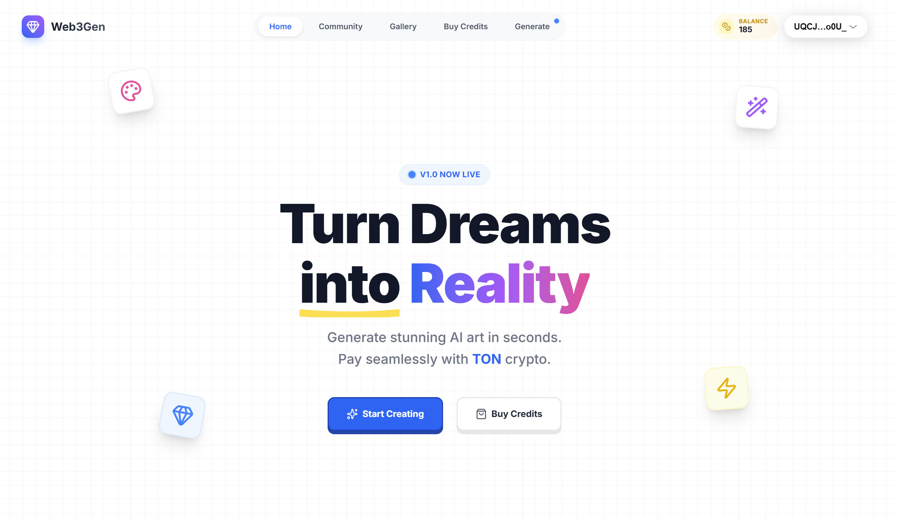
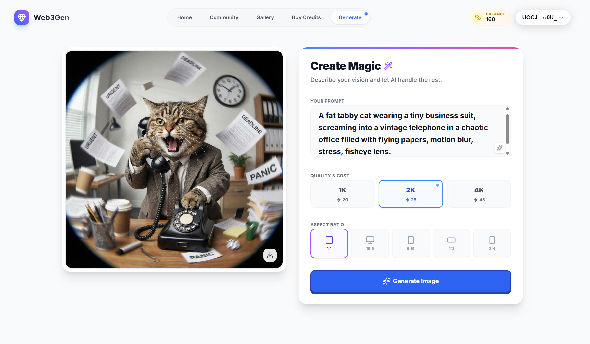
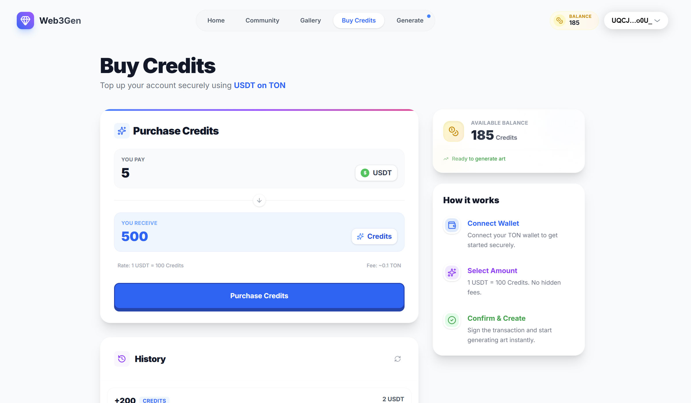
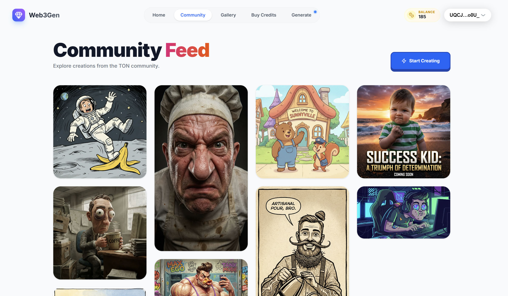
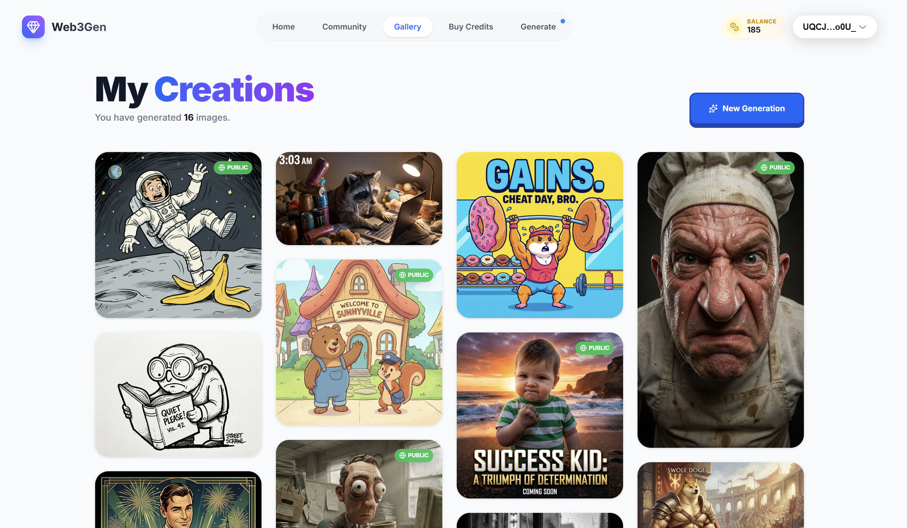
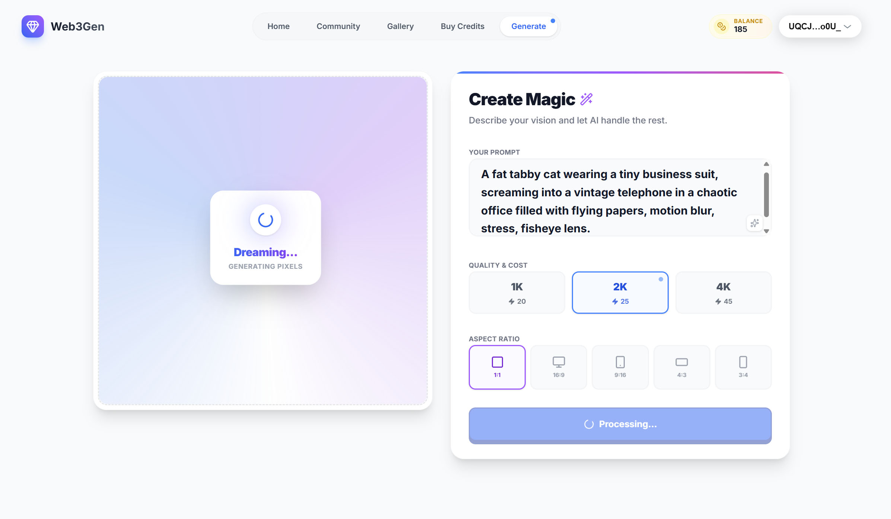
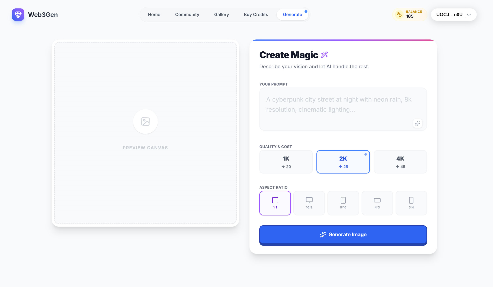
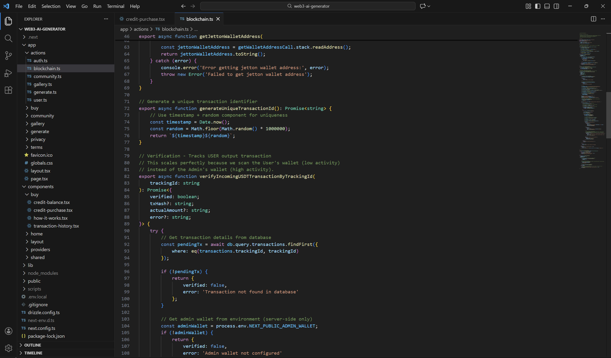

# 🎨 Web3Gen - AI Image Generator on TON Blockchain
### Production-Ready SaaS Source Code

**Launch your own AI SaaS in minutes.** This is a complete, production-grade AI Image Generator platform integrated with the **TON Blockchain** for crypto payments. It features a modern credit system, community gallery, and secure authentication.

---

## ✨ Application Preview

### 🚀 Hero Section
A stunning, responsive landing page designed to convert visitors into users immediately.

### 🎨 Powerful Generation Studio
Users can generate high-quality AI images with adjustable settings for Aspect Ratio, Quality, and Prompts.

### 💎 Crypto Payments (USDT on TON)
Seamlessly monetized with a built-in credit system. Users pay with **USDT on the TON Blockchain** to top up their balance. The transaction verification is fully automated on the backend.

---

## ⚡ Key Features

This source code is a fully functional SaaS (Software as a Service) platform.

* **🤖 Advanced AI Generation:** Integration with Replicate API (Flux/Stable Diffusion) for high-fidelity text-to-image generation.
* **💳 Web3 Payments:** Native integration with **TON Connect**. Accepts USDT payments directly on-chain with automated transaction verification.
* **🔐 Secure Authentication:** Robust auth system using **TON Proof** (wallet signature verification) to log users in without passwords.
* **💰 Credit System:** Built-in economy where users purchase credits to generate images. Complete database schema for tracking balances and transactions.
* **🌍 Community Feed:** A public gallery where users can showcase their creations and inspire others.
* **📂 Private Gallery:** Users have their own "My Creations" tab to manage and view their history.
* **📱 Fully Responsive:** Beautifully crafted UI/UX that works perfectly on Desktop and Mobile.

---

## 📸 User Journey Gallery

| **Community Feed** | **My Creations** |
| :---: | :---: |
|  |  |
| *Explore trending art from the community* | *Manage your personal generation history* |

| **Loading State** | **Empty State** |
| :---: | :---: |
|  |  |
| *Smooth animations for better UX* | *Polished UI even when data is empty* |

---

## 🛠️ Tech Stack & Architecture

Built with the latest, most scalable technologies for 2025.

| Component | Technology | Description |
| :--- | :--- | :--- |
| **Framework** | **Next.js 15** | App Router, Server Actions, and React 19. |
| **Blockchain** | **TON SDK** | `@ton/ton`, `@tonconnect/ui-react` for wallet interactions. |
| **Database** | **PostgreSQL (Neon)** | Serverless Postgres database. |
| **ORM** | **Drizzle ORM** | Type-safe database queries and schema management. |
| **Styling** | **Tailwind CSS** | Modern, responsive styling with Framer Motion animations. |
| **Storage** | **Vercel Blob** | Secure cloud storage for generated images. |

### 👨‍💻 Clean, Modular Codebase
The code is architected for scalability and maintainability.

---

## 📦 What You Get

When you purchase the full source code, you receive:

1.  **Complete Source Code:** Full access to the GitHub repository.
2.  **Database Schema:** Drizzle configuration and migration files.
3.  **Setup Guide:** Comprehensive documentation on how to deploy to Vercel and set up environment variables.
4.  **Free Updates:** Access to future improvements and bug fixes.

### 💰 Monetization Ready
This isn't just a template; it's a business in a box.
1.  **User connects wallet.**
2.  **User buys credits** (Funds go directly to YOUR wallet).
3.  **User generates AI art.**
4.  **You profit.**

---

## 🚀 Get the Source Code

Stop coding from scratch. Save hundreds of hours of development time and launch your Web3 AI startup today.

**[👉 Purchase on Nikandr.com](https://nikandr.com/en/product/ai-image-generator-ton-blockchain-payments/preview)**

---

*Note: This repository serves as a preview showcase. The full functional source code is available exclusively at the link above.*
